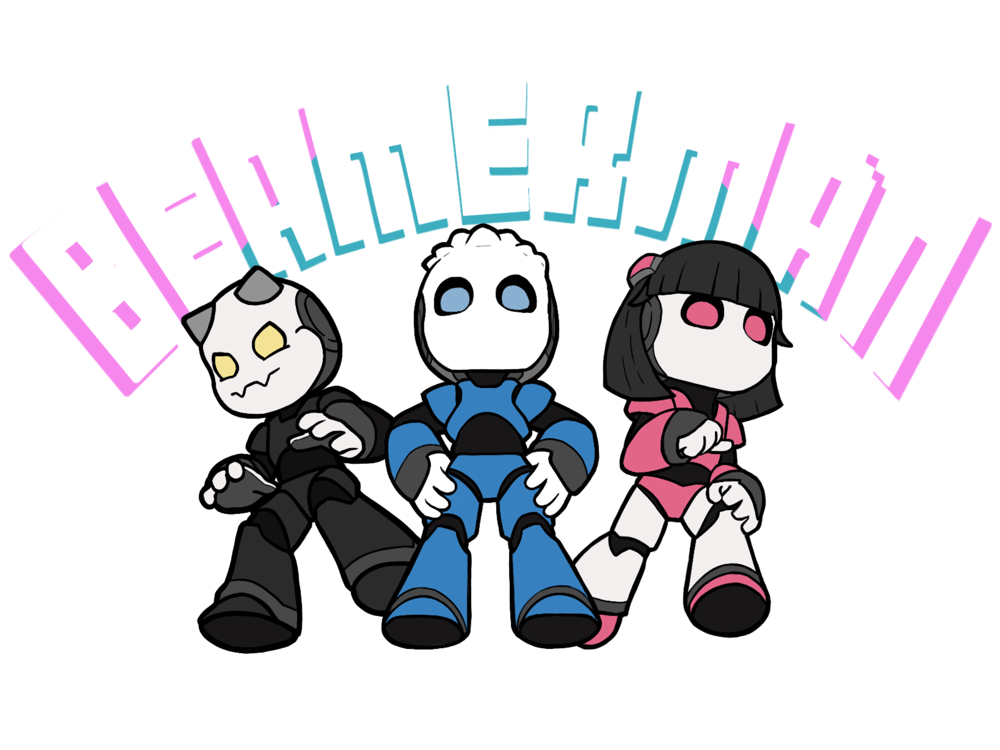

    

Beamerman is a fast-paced isometric action game, in which players fire lazer beams and strategically reflect them to defeat their enemies while trying to avoid catching themselves in the crossfire. The game largely takes its inspiration from classics such as Bomberman and Playing With Fire 2.

The game was developed for the module [CS3247 Game Development](https://nusmods.com/modules/CS3247/game-development), and was further developed in [CS4350 Game Development Project](https://nusmods.com/modules/CS4350/game-development-project).

The game was developed using Unreal Engine 4.24.3, for PC.

## FAQ
To connect a gamepad to the game, please follow these steps:

1. Open Steam overlay with Shift + Tab
2. In the top right corner, click 'Controller Configuration'
3. On the bottom of the Controller Configurator, click 'Browse Configs'
4. Select Templates -> Gamepad
5. On the bottom, click 'Apply Configuration'

## Credits

### Assets
- [Character Models & Assets](https://www.unrealengine.com/marketplace/en-US/product/chibi-characters)

### Sound
- [Main Menu Background Music](https://www.youtube.com/watch?v=w1MYuE1eZVo)
- [Level Background Music by Playonloop.com](https://opengameart.org/content/hesitation-synth-electronic-loop)

